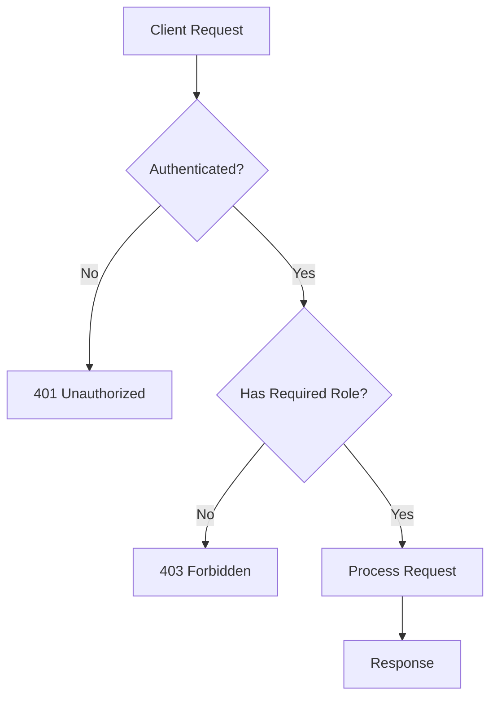
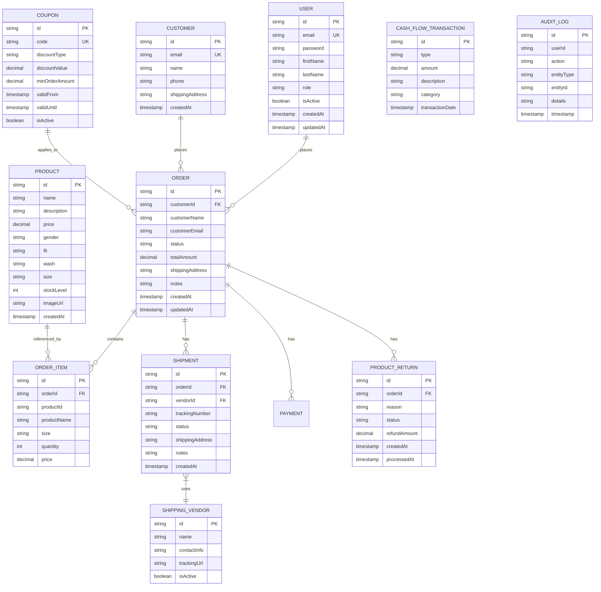

# Jane's Jeans Dashboard - API Architecture & Review

## Table of Contents

1. [Overview](#overview)
2. [Technology Stack](#technology-stack)
3. [API Architecture](#api-architecture)
4. [Security & Authentication](#security--authentication)
5. [API Endpoints by Domain](#api-endpoints-by-domain)
6. [Database Schema](#database-schema)
7. [Request/Response Formats](#requestresponse-formats)

---

## Overview

The Jane's Jeans Dashboard is a full-stack e-commerce application built with Spring Boot backend and React frontend. The backend provides a comprehensive RESTful API for managing products, orders, customers, shipments, coupons, and administrative functions.

---

## Technology Stack

### Backend
- **Framework**: Spring Boot 3.x
- **Language**: Java 17+
- **Database**: MySQL with Liquibase migrations
- **Authentication**: JWT (JSON Web Tokens)
- **API Documentation**: OpenAPI 3.0 (Swagger)
- **Build Tool**: Maven

### Key Dependencies
- Spring Security
- Spring Data JPA
- Spring Web
- Spring Validation
- JJWT (JWT Library)
- Lombok
- MapStruct
- OpenAPI Annotations

---

## API Architecture

### Base URL
```
Production: https://api.janesjeans.com
Development: http://localhost:8080
```

### API Versioning
All endpoints are prefixed with `/api/{version}` - currently v1.

### Response Format

**Success Response**
```json
{
  "data": { },
  "message": "Success",
  "status": 200
}
```

**Error Response**
```json
{
  "error": "Error message",
  "status": 400,
  "timestamp": "2024-01-01T00:00:00Z"
}
```

---

## Security & Authentication

### Authentication Methods

| Method | Endpoint | Description |
|--------|----------|-------------|
| User Registration | `POST /api/auth/register` | Register new user account |
| User Login | `POST /api/auth/login` | Authenticate and get JWT tokens |
| Admin Login | `POST /api/auth/admin/login` | Admin-specific authentication |
| Token Refresh | `POST /api/auth/refresh` | Refresh expired access token |
| Token Validation | `GET /api/auth/validate` | Validate current JWT token |

### JWT Token Structure

**Access Token**
- Expiration: Configurable (default: 1 hour)
- Contains: User ID, email, role

**Refresh Token**
- Expiration: Configurable (default: 7 days)
- Used to obtain new access tokens

### Security Requirements



### Role-Based Access Control

| Role | Description | Endpoints Access |
|------|-------------|------------------|
| `USER` | Regular customer | Shop endpoints, own orders |
| `ADMIN` | Store administrator | All authenticated endpoints |
| `SUPER_ADMIN` | System administrator | Full system access including user management |

### Security Configuration

The application uses Spring Security with JWT authentication filter:

- **CORS Configuration**: Configured in [`CorsConfig.java`](backend/src/main/java/com/janesjeans/api/config/CorsConfig.java)
- **JWT Filter**: Implemented in [`JwtAuthenticationFilter.java`](backend/src/main/java/com/janesjeans/api/config/JwtAuthenticationFilter.java)
- **Security Config**: Defined in [`SecurityConfig.java`](backend/src/main/java/com/janesjeans/api/config/SecurityConfig.java)

---

## API Endpoints by Domain

### 1. Authentication (`/api/auth`)

| Method | Endpoint | Description | Auth Required | Tags |
|--------|----------|-------------|--------------|------|
| POST | `/api/auth/register` | Register new user | No | Public |
| POST | `/api/auth/login` | User login | No | Public |
| POST | `/api/auth/admin/login` | Admin login | No | Public |
| POST | `/api/auth/refresh` | Refresh token | Yes | Auth |
| GET | `/api/auth/validate` | Validate token | Yes | Auth |
| GET | `/api/auth/health` | Health check | No | Public |

**Request Example - Login**
```json
{
  "email": "user@example.com",
  "password": "password123"
}
```

**Response Example**
```json
{
  "accessToken": "eyJhbGciOiJIUzI1NiIs...",
  "refreshToken": "eyJhbGciOiJIUzI1NiIs...",
  "expiresIn": 3600,
  "tokenType": "Bearer"
}
```

---

### 2. Shop - Public Endpoints (`/api/shop`)

Public storefront endpoints - no authentication required.

| Method | Endpoint | Description |
|--------|----------|-------------|
| GET | `/api/shop/categories` | List all shop categories with subcategories |
| GET | `/api/shop/catalog` | Search & browse shop products (paginated) |
| GET | `/api/shop/catalog/{id}` | Get product details by ID |
| GET | `/api/shop/products` | List all shop products (legacy) |
| GET | `/api/shop/products/{id}` | Get shop product by ID (legacy) |
| POST | `/api/shop/check-stock` | Check stock availability for cart items |
| POST | `/api/shop/orders` | Create guest order |
| POST | `/api/shop/orders/confirm` | Confirm guest order with payment & shipment |
| POST | `/api/shop/orders/confirm-with-otp` | Create order with OTP verification |

**Catalog Query Parameters**
```
GET /api/shop/catalog?category=skincare&subcategory=serums&search=vitamin&inStock=true&minPrice=10&maxPrice=100&page=0&size=12&sortBy=price&sortDir=asc
```

| Parameter | Type | Description |
|-----------|------|-------------|
| `category` | string | Filter by category slug |
| `subcategory` | string | Filter by subcategory slug |
| `search` | string | Search by name or description |
| `inStock` | boolean | Filter by stock availability |
| `minPrice` | decimal | Minimum price filter |
| `maxPrice` | decimal | Maximum price filter |
| `page` | integer | Page number (0-based) |
| `size` | integer | Page size |
| `sortBy` | string | Sort field: name, price, rating, reviews, createdAt |
| `sortDir` | string | Sort direction: asc, desc |

---

### 3. Products (`/api/products`)

Product inventory management - authentication required.

| Method | Endpoint | Description |
|--------|----------|-------------|
| GET | `/api/products` | List all products (optional: ?gender=Men/Women) |
| GET | `/api/products/{id}` | Get product by ID |
| POST | `/api/products` | Create new product |
| PUT | `/api/products/{id}` | Update product |
| DELETE | `/api/products/{id}` | Delete product |

---

### 4. Customers (`/api/customers`)

Customer management - authentication required.

| Method | Endpoint | Description |
|--------|----------|-------------|
| GET | `/api/customers` | List all customers |
| GET | `/api/customers/{id}` | Get customer by ID |
| POST | `/api/customers` | Create customer |
| PUT | `/api/customers/{id}` | Update customer |
| DELETE | `/api/customers/{id}` | Delete customer |

---

### 5. Orders (`/api/orders`)

Order management - authentication required.

| Method | Endpoint | Description |
|--------|----------|-------------|
| GET | `/api/orders` | List all orders |
| GET | `/api/orders/{id}` | Get order by ID |
| POST | `/api/orders` | Create order |
| PUT | `/api/orders/{id}` | Update order |
| PUT | `/api/orders/{id}/status` | Update order status |
| DELETE | `/api/orders/{id}` | Delete order |
| POST | `/api/orders/{id}/confirm-email` | Send order confirmation email |

**Order OTP Flow**
| Method | Endpoint | Description |
|--------|----------|-------------|
| POST | `/api/orders/{id}/request-otp` | Request OTP for order |
| POST | `/api/orders/{id}/verify-otp` | Verify OTP for order |
| POST | `/api/orders/{id}/skip-verify` | Skip OTP verification |

---

### 6. Shipments (`/api/shipments`)

Shipment tracking and management - authentication required.

| Method | Endpoint | Description |
|--------|----------|-------------|
| GET | `/api/shipments` | List all shipments |
| GET | `/api/shipments/{id}` | Get shipment by ID |
| GET | `/api/shipments/order/{orderId}` | Get shipment by order ID |
| POST | `/api/shipments` | Create shipment |
| PUT | `/api/shipments/{id}` | Update shipment |
| PUT | `/api/shipments/{id}/status` | Update shipment status |
| DELETE | `/api/shipments/{id}` | Delete shipment |

---

### 7. Shipping Vendors (`/api/vendors`)

Shipping vendor management - authentication required.

| Method | Endpoint | Description |
|--------|----------|-------------|
| GET | `/api/vendors` | List all vendors |
| GET | `/api/vendors/{id}` | Get vendor by ID |
| POST | `/api/vendors` | Create vendor |
| PUT | `/api/vendors/{id}` | Update vendor |
| DELETE | `/api/vendors/{id}` | Delete vendor |

---

### 8. Coupons (`/api/coupons`)

Coupon and discount management - authentication required.

| Method | Endpoint | Description |
|--------|----------|-------------|
| GET | `/api/coupons` | List all coupons |
| GET | `/api/coupons/{id}` | Get coupon by ID |
| GET | `/api/coupons/code/{code}` | Get coupon by code |
| POST | `/api/coupons` | Create coupon |
| PUT | `/api/coupons/{id}` | Update coupon |
| DELETE | `/api/coupons/{id}` | Delete coupon |
| POST | `/api/coupons/validate` | Validate coupon and calculate discount |

**Validate Coupon Request**
```json
{
  "code": "SUMMER20",
  "orderTotal": 100.00
}
```

**Validate Coupon Response**
```json
{
  "valid": true,
  "discount": 20.00,
  "couponCode": "SUMMER20",
  "discountType": "PERCENTAGE",
  "discountValue": 20
}
```

---

### 9. Cash Flow (`/api/cash-flow`)

Financial transaction management - authentication required.

| Method | Endpoint | Description |
|--------|----------|-------------|
| GET | `/api/cash-flow` | List all transactions |
| GET | `/api/cash-flow/{id}` | Get transaction by ID |
| GET | `/api/cash-flow/type/{type}` | Get transactions by type (INCOME/EXPENSE) |
| GET | `/api/cash-flow/range` | Get transactions by date range |
| POST | `/api/cash-flow` | Create transaction |
| PUT | `/api/cash-flow/{id}` | Update transaction |
| DELETE | `/api/cash-flow/{id}` | Delete transaction |
| GET | `/api/cash-flow/summary` | Get cash flow summary |
| GET | `/api/cash-flow/summary/range` | Get summary for date range |

---

### 10. Product Returns (`/api/returns`)

Product return and refund management - authentication required.

| Method | Endpoint | Description |
|--------|----------|-------------|
| GET | `/api/returns` | List all returns |
| GET | `/api/returns/{id}` | Get return by ID |
| GET | `/api/returns/order/{orderId}` | Get returns by order ID |
| GET | `/api/returns/status/{status}` | Get returns by status |
| POST | `/api/returns` | Create return request |
| PUT | `/api/returns/{id}` | Update return |
| POST | `/api/returns/{id}/approve` | Approve return |
| POST | `/api/returns/{id}/reject` | Reject return |
| DELETE | `/api/returns/{id}` | Delete return |

---

### 11. Admin - Users (`/api/admin/users`)

User management - ADMIN/SUPER_ADMIN only.

| Method | Endpoint | Description |
|--------|----------|-------------|
| GET | `/api/admin/users` | List all users |
| GET | `/api/admin/users/{id}` | Get user by ID |
| PUT | `/api/admin/users/{id}` | Update user details |
| PATCH | `/api/admin/users/{id}/role` | Update user role |
| PATCH | `/api/admin/users/{id}/activate` | Activate user |
| PATCH | `/api/admin/users/{id}/deactivate` | Deactivate user |
| DELETE | `/api/admin/users/{id}` | Delete user |
| POST | `/api/admin/users/{id}/reset-password` | Reset user password |
| POST | `/api/admin/users/create-admin` | Create new admin user |

---

### 12. Admin - Audit Logs (`/api/admin/audit-logs`)

Audit logging - ADMIN/SUPER_ADMIN only.

| Method | Endpoint | Description |
|--------|----------|-------------|
| GET | `/api/admin/audit-logs` | List audit logs (paginated) |
| POST | `/api/admin/audit-logs` | Create audit log entry |

**Query Parameters**
```
GET /api/admin/audit-logs?action=LOGIN&userId=user123&page=0&limit=20
```

| Parameter | Type | Description |
|-----------|------|-------------|
| `action` | string | Filter by action type |
| `userId` | string | Filter by user ID |
| `page` | integer | Page number (0-based) |
| `limit` | integer | Results per page |

---

## Database Schema

### Core Entities



---

## Request/Response Formats

### DTOs (Data Transfer Objects)

| DTO | Location | Description |
|-----|----------|-------------|
| `AuthResponse` | [`dto/AuthResponse.java`](backend/src/main/java/com/janesjeans/api/dto/AuthResponse.java) | Authentication response with tokens |
| `LoginRequest` | [`dto/LoginRequest.java`](backend/src/main/java/com/janesjeans/api/dto/LoginRequest.java) | Login credentials |
| `RegisterRequest` | [`dto/RegisterRequest.java`](backend/src/main/java/com/janesjeans/api/dto/RegisterRequest.java) | Registration data |
| `UserDTO` | [`dto/UserDTO.java`](backend/src/main/java/com/janesjeans/api/dto/UserDTO.java) | User information |
| `PaginatedCatalogResponse` | [`dto/PaginatedCatalogResponse.java`](backend/src/main/java/com/janesjeans/api/dto/PaginatedCatalogResponse.java) | Paginated product catalog |
| `ShopProductDTO` | [`dto/ShopProductDTO.java`](backend/src/main/java/com/janesjeans/api/dto/ShopProductDTO.java) | Shop product details |
| `ShopProductDetailDTO` | [`dto/ShopProductDetailDTO.java`](backend/src/main/java/com/janesjeans/api/dto/ShopProductDetailDTO.java) | Detailed product info |
| `ShopCategoryDTO` | [`dto/ShopCategoryDTO.java`](backend/src/main/java/com/janesjeans/api/dto/ShopCategoryDTO.java) | Category with subcategories |
| `GuestOrderRequest` | [`dto/GuestOrderRequest.java`](backend/src/main/java/com/janesjeans/api/dto/GuestOrderRequest.java) | Guest checkout request |
| `GuestOrderResponse` | [`dto/GuestOrderResponse.java`](backend/src/main/java/com/janesjeans/api/dto/GuestOrderResponse.java) | Order confirmation |

---

## API Summary Table

| Domain | Base Path | Auth Required | Admin Only |
|--------|-----------|---------------|------------|
| Authentication | `/api/auth` | Mixed | No |
| Shop | `/api/shop` | No | No |
| Products | `/api/products` | Yes | No |
| Customers | `/api/customers` | Yes | No |
| Orders | `/api/orders` | Yes | No |
| Shipments | `/api/shipments` | Yes | No |
| Vendors | `/api/vendors` | Yes | No |
| Coupons | `/api/coupons` | Yes | No |
| Cash Flow | `/api/cash-flow` | Yes | No |
| Returns | `/api/returns` | Yes | No |
| Admin Users | `/api/admin/users` | Yes | Yes |
| Audit Logs | `/api/admin/audit-logs` | Yes | Yes |

---

## Configuration

### Environment Variables

| Variable | Description | Default |
|----------|-------------|---------|
| `DB_HOST` | Database host | localhost |
| `DB_PORT` | Database port | 3306 |
| `DB_NAME` | Database name | janesjeans |
| `DB_USER` | Database username | root |
| `DB_PASSWORD` | Database password | - |
| `JWT_SECRET` | JWT signing secret | - |
| `JWT_EXPIRATION` | JWT expiration (ms) | 3600000 |
| `SPRING_MAIL_HOST` | SMTP server | - |
| `SPRING_MAIL_PORT` | SMTP port | 587 |

---

## OpenAPI Documentation

The API is documented using OpenAPI 3.0. Access the interactive Swagger UI at:

```
Production: https://api.janesjeans.com/swagger-ui.html
Development: http://localhost:8080/swagger-ui.html
```

OpenAPI JSON available at:
```
/v3/api-docs
```

---

## Error Handling

Standard HTTP status codes are used:

| Code | Description |
|------|-------------|
| 200 | Success |
| 201 | Created |
| 400 | Bad Request |
| 401 | Unauthorized |
| 403 | Forbidden |
| 404 | Not Found |
| 409 | Conflict |
| 500 | Internal Server Error |

Global exception handling is implemented in:
[`GlobalExceptionHandler.java`](backend/src/main/java/com/janesjeans/api/exception/GlobalExceptionHandler.java)

---

## Version History

| Version | Date | Changes |
|---------|------|---------|
| 1.0.0 | Initial | Initial release with core features |
| 1.1.0 | Current | Added OTP verification, audit logs, cash flow |

---

*Last Updated: 2024*
*Generated from: Jane's Jeans Dashboard Backend*
